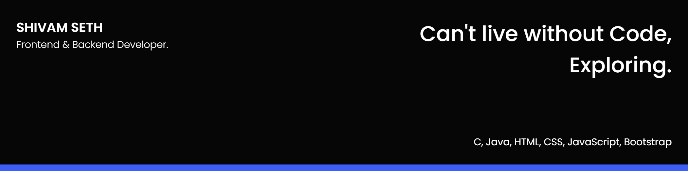

<!--

-->
## 🧔 About Me

- 🔭 I’m M.C.A student, Dr.Harisingh Gaur Sagar University

- 🌱 I’m currently learning Java8, JavaScript, HTML5, CSS3

- 👯 I’m looking to collaborate on Google's Code

- 📄 My Resume [https://drive.google.com/file/d/19USoTM_YAVK2jK4b_QRm1lFLcmXr6PfF/view?usp=sharing](https://drive.google.com/file/d/1vB8QgmciYHels1Z4C2-e6MxtLCcQ66cd/view?usp=sharing)

- ⚡️ Fun fact: 😜😉

## ✍️ My Work

**Languages and Tools:**  

<code></code>
<code></code>
<code></code>
<code></code>

## 🤝 Connect

<!--
**ShivamSeth05/ShivamSeth05** is a ✨ _special_ ✨ repository because its `README.md` (this file) appears on your GitHub profile.

Here are some ideas to get you started:

- 🔭 I’m currently working on ...
- 🌱 I’m currently learning ...
- 👯 I’m looking to collaborate on ...
- 🤔 I’m looking for help with ...
- 💬 Ask me about ...
- 📫 How to reach me: ...
- 😄 Pronouns: ...
- ⚡ Fun fact: ...
-->
